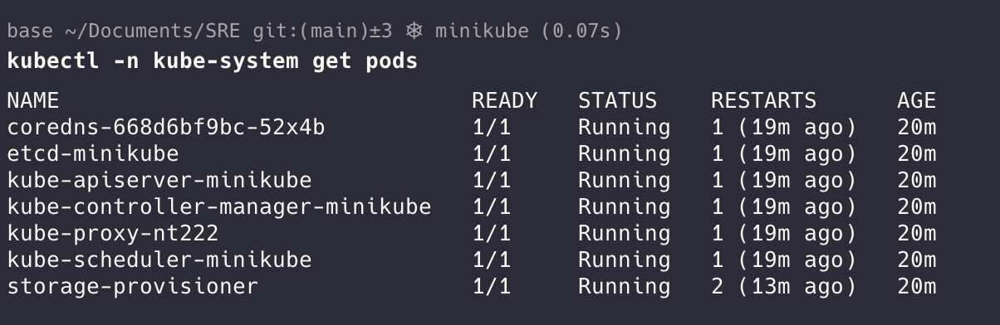

## Kubernetes

Kubernetes is a powerful container orchestration platform that consists of several key components working together to manage and deploy containerized applications.

Kubernetes functionalities:

- Deployment: Kubernetes automates the deployment of containerized applications across a cluster of nodes.
- Scaling: It automatically scales applications up or down based on demand, ensuring optimal resource utilization.
- Load Balancing: Kubernetes evenly distributes traffic across different instances of your application, ensuring high availability and responsiveness.
- Service Discovery: It enables applications to discover and communicate with each other, regardless of their location within the cluster.
- Health Monitoring: Kubernetes monitors the health of your applications and automatically restarts them if they fail.
- Security: Kubernetes provides a robust security framework for managing access control and protecting your applications.
- Self-healing: Kubernetes restarts containers that fail, replaces containers, kills containers that don't respond to your user-defined health check, and doesn't advertise them to clients until they are ready to serve.
- Horizontal scaling: Scale your application up and down with a simple command, with a UI, or automatically based on CPU usage.

#### Components

- Control Plane Node ->
  Control plane nodes in Kubernetes play a critical role in managing the cluster's state and configuration. They are responsible for making global decisions about the cluster (like scheduling), as well as detecting and responding to cluster events (like starting up a new pod when a deployment's replicas field is unsatisfied). Here are the key components of control plane nodes:

- API Server

  Serves as the front end for the Kubernetes control plane. The API server is responsible for handling requests, validating them, and updating the corresponding objects in the cluster. It exposes the Kubernetes API. - Cluster Data Store – etcd
  It’s the only stateful part of the cluster which persists the entire cluster configuration aka desired state and the current state of the cluster. - Controller Manager
  Manages controllers that regulate the state of the cluster. Controllers are responsible for maintaining the desired state and handling tasks like node management, replication, and endpoints. - Scheduler
  Assigns pods to nodes based on resource availability, constraints, and other policies. The scheduler makes decisions to ensure that the workload is evenly distributed across the cluster.

- Worker Node (Minion) -> Worker nodes in Kubernetes are the machines (physical or virtual) where your actual applications (containers) run. They are managed by the control plane and perform the requested, necessary workloads. Each worker node is a part of the Kubernetes cluster and has the necessary components to orchestrate and run applications. Here are the key components of a worker node:

- Kubelet

  An agent running on each node that communicates with the control plane node's API server. It ensures that containers are running in a pod and reports back to the control plane about the node's status. - Container Runtime
  Responsible for managing the entire container lifecycle on the node. Containerd is one of the leading container runtimes. - Kube Proxy
  It is a Kubernetes agent installed on every node in the cluster. It is responsible for local cluster networking. It implements local IPTABLES or IPVS rules to handle routing and load-balancing of traffic on the Pod network. It monitors the changes that happen to Service objects and their endpoints. If changes occur, it translates them into actual network rules inside the node. Kube-Proxy is installed as an add-on during the installation process, usually created as a DaemonSet.

- Pod: A pod is the smallest deployable unit in Kubernetes, representing a single instance of a running process in a cluster

- ReplicaSet: Manages the lifecycle of pods and ensures that a specified number of replicas for a pod are running at all times.

- Deployment: Provides declarative updates to applications

- Service: Defines a set of pods and a policy to access them.

- Volume: Manages storage and provides data persistence for containers

- Namespace: Provides a way to divide cluster resources into multiple virtual clusters.

- ConfigMap and Secret: ConfigMaps and Secrets are used to manage configuration data and sensitive information (such as passwords or API keys) separately from the application code.

- Kubernetes Dashboard: A web-based UI for visually managing and monitoring the Kubernetes cluster

---

Need a cluster

For Example is minikube

Commands

```
minikube start

kubectl get nodes

kubectl get

kubectl edit

kubectl delete

kubectl apply ->

kubectl exec -> allow to execute a command inside a container

kubectl logs

kubectl cp -> copy files from PC to container

kubectl port-forward -> forward a port


--- NODES
kubectl cordon -> mark the node as unscheduable

kubectl uncordon -> mark the node as scheduable

kubectl drain -> drain node in preparation

kubectl config get-contexts

```

Nodos -> Recursos de Kubernetes que corren nuestras aplicaciones

---

Namespace
-> logic division of K8 cluster
-> allow to separate charges && resources

```
kubectl get ns
```

---

### POD

- Set de contenedores
- 1 o mas contenedores
- Generalmente 1 por POD

```
kubectl -n kube-system get pods

kubectl describe pod ...podname
```



Show more info

```
kubectl -n kube-system get pods -o wide
```

Delete PODS

```
kubectl -n kube-system delete pod
```

Example #1

```
  1 apiVersion: v1
  2 kind: Pod
  3 metadata:
  4   name: nginx
  5 spec:
  6   containers:
  7   - name: nginx
  8     image: nginx:alpine
```

Apply that manifest

```
kubectl apply -f 01-pod.yaml

kubectl get pods

kubectl exec -it nginx -- sh
```

Example #2

```
  1 apiVersion: v1
  2 kind: Pod
  3 metadata:
  4   name: nginx
  5 spec:
  6   containers:
  7   - name: nginx
  8     image: nginx:alpine
  9     env:
 10     - name: MI_VARIABLE
 11       value: "pelado"
 12     - name: MI_OTRA_VARIABLE
 13       value: "pelade"
 14     - name: DD_AGENT_HOST
 15       valueFrom:
 16         fieldRef:
 17           fieldPath: status.hostIP
 18     resources:
 19       requests:
 20         memory: "64Mi"
 21         cpu: "200m"
 22       limits:
 23         memory: "128Mi"
 24         cpu: "500m"
 25     readinessProbe:
 26       httpGet:
 27         path: /
 28         port: 80
 29       initialDelaySeconds: 5
 30       periodSeconds: 10
 31     livenessProbe:
 32       tcpSocket:
 33         port: 80
 34       initialDelaySeconds: 15
 35       periodSeconds: 20
 36     ports:
 37     - containerPort: 80

```

---

Downware IP -> valores que se pueden heredar, ejemplo ip del host

Variables de entorno:

```
  9     env:
 10     - name: MI_VARIABLE
 11       value: "pelado"
 12     - name: MI_OTRA_VARIABLE
 13       value: "pelade"
 14     - name: DD_AGENT_HOST
 15       valueFrom:
 16         fieldRef:
 17           fieldPath: status.hostIP
```

Resources

- request -> recurso que le garantizamos al pod que siempre va a tener disponibles
- limits -> limite que pueden llegar a usar, si pasan mas de eso el kernel de linux mata el proceso (restart pod)

memory: "64Mi" -> Megas memoria ram

cpu: "200m" -> 200 milicore , 1000 milicore es un core

```
 18     resources:
 19       requests:
 20         memory: "64Mi"
 21         cpu: "200m"
 22       limits:
 23         memory: "128Mi"
 24         cpu: "500m"
```

---

RedinessProbe -> forma de explicarle a kubernetes que mi pod esta listo para recibir trafico

LivenessProva -> forma de explicarle a k8 que mi pod esta vivo

```

 25     readinessProbe:
 26       httpGet:
 27         path: /
 28         port: 80
 29       initialDelaySeconds: 5
 30       periodSeconds: 10
 31     livenessProbe:
 32       tcpSocket:
 33         port: 80
 34       initialDelaySeconds: 15
 35       periodSeconds: 20

```

### Deployments

```
  5 spec:
  6   selector:
  7     matchLabels:
  8       app: nginx
  9   replicas: 2
 10   template:
 11     metadata:
 12       labels:
 13         app: nginx
 14     spec:

```

Delete a deployment
kubectl delete -f 04-deployment.yaml

### Daemonset

Forma de deployar un pod en cada nodos

Sirva para servicios de monitoreo

### Statefulset

Forma de crear pods que tienen volumen

Sirve para base de datos

```
kubectl get statefulsets / kubectl get sts
```

```
volumeMounts:
 23         - mountPath: "/data"
 24           name: csi-pvc
 25   volumeClaimTemplates:
 26   - metadata:
 27       name: csi-pvc
 28     spec:
 29       accessModes:
 30       - ReadWriteOnce
 31       resources:
 32         requests:
 33           storage: 5Gi
 34       storageClassName: do-block-storage

```

### PVC

persisten volume claim

```
kubectl get pvc

kubectl describe pvc ...name

```

### Pod networking

etcd -> base de datos de k8 , se guarda el stado

CNI -> cloud cluster networking interface (crea una vpn entre los nodos)

Cada pod tiene su propia IP
Los contenedores dentro de ese pod comparten la misma IP

#### Servicios

- Cluster IP -> ip fija dentor de cluster -> load balancer entre los pods

  - Crear ip dentor del cluster que es privada, y nos lleva a los pods basado en el selector (mensaje de etiquetas)

- Node Port -> crear un puerto en cada nodo que recibe trafrico y se lo envia a los pods que yo quiera

  - Crear servicio que encuentra pods basado en etiquetas pero crea un puerto publico en cada nodo que se puede entrar desde afuera

- Load Balancer -> crear un balancerador de cargas en nuestro provedor de nube y balancear los pods - conecta cluster de k8 con provedor de nube
  Cluster IP -> in the last selector -> role -> uses the name of the pod name

```yaml
apiVersion: apps/v1
kind: Deployment
metadata:
  name: hello
spec:
  replicas: 3
  selector:
    matchLabels:
      role: hello
  template:
    metadata:
      labels:
        role: hello
    spec:
      containers:
        - name: hello
          image: gcr.io/google-samples/hello-app:1.0
          ports:
            - containerPort: 8080

---
apiVersion: v1
kind: Service
metadata:
  name: hello
spec:
  ports:
    - port: 8080
      targetPort: 8080
  selector:
    role: hello
```

To see all

```yaml
kubectl get all
```

Describe a service

```yaml
kubectl describe svc hello
```

NodePort

```yaml
apiVersion: apps/v1
kind: Deployment
metadata:
  name: hello
spec:
  replicas: 3
  selector:
    matchLabels:
      role: hello
  template:
    metadata:
      labels:
        role: hello
    spec:
      containers:
        - name: hello
          image: gcr.io/google-samples/hello-app:1.0
          ports:
            - containerPort: 8080

---
apiVersion: v1
kind: Service
metadata:
  name: hello
spec:
  type: NodePort
  ports:
    - port: 8080
      targetPort: 8080
      nodePort: 30000
  selector:
    role: hello
```

Load Balancer

```yaml
  1 apiVersion: apps/v1
  2 kind: Deployment
  3 metadata:
  4   name: hello
  5 spec:
  6   replicas: 3
  7   selector:
  8     matchLabels:
  9       role: hello
 10   template:
 11     metadata:
 12       labels:
 13         role: hello
 14     spec:
 15       containers:
 16       - name: hello
 17         image: gcr.io/google-samples/hello-app:1.0
 18         ports:
 19         - containerPort: 8080
 20
 21 ---
 22 apiVersion: v1
 23 kind: Service
 24 metadata:
 25   name: hello
 26 spec:
 27   type: LoadBalancer
 28   ports:
 29   - port: 8080
 30     targetPort: 8080
 31   selector:
 32     role: hello
```

---

### Ingress

Tipo de servicio que permite crear accesos a nuestros servicios basado en el path

k8 hace un deploy de un controlado nginx, este nginx tiene un controlador espceial que va a leer este tipo de recursos llamado ingress y se va a autoconfigurar

Con esto no es necesario crear subdominios ni nada de eso estilo

Hay que instalar nginx

SOlo corre en cloud provider por eso no tiene address

```bash
kubectl get ing
NAME        CLASS    HOSTS   ADDRESS   PORTS   AGE
hello-app   <none>   *                 80      26s
```

Se crea un loadbalancer automatico

Para llegar a algun servicio es: load_balancer_address/servicio

```bash
kubectl -n ingress-nginx get svc
```

```yaml
apiVersion: networking.k8s.io/v1
kind: Ingress
metadata:
  name: hello-app
spec:
  rules:
    - http:
        paths:
          - path: /v1
            pathType: Prefix
            backend:
              service:
                name: hello-v1
                port:
                  number: 8080
          - path: /v2
            pathType: Prefix
            backend:
              service:
                name: hello-v2
                port:
                  number: 8080
```

---

### Configmap

Archivo que se hostea en k8 y se puede acceder desde los pods
Funciona para poner en un repo varibles de entorno

```
  1 apiVersion: v1
  2 kind: ConfigMap
  3 metadata:
  4   name: game-demo
  5 data:
  6   # property-like keys; each key maps to a simple value
  7   player_initial_lives: "3"
  8   ui_properties_file_name: "user-interface.properties"
  9   #
 10   # file-like keys
 11   game.properties: |
 12     enemy.types=aliens,monsters
 13     player.maximum-lives=5
 14   user-interface.properties: |
 15     color.good=purple
 16     color.bad=yellow
 17     allow.textmode=true
~
```

```yaml
 1 apiVersion: v1
  2 kind: Pod
  3 metadata:
  4   name: nginx
  5 spec:
  6   containers:
  7     - name: nginx
  8       image: nginx:alpine
  9       env:
 10         # Define the environment variable
 11         - name: PLAYER_INITIAL_LIVES # Nombre de la variable
 12           valueFrom:
 13             configMapKeyRef:
 14               name: game-demo           # El confimap desde donde vienen los valores
 15               key: player_initial_lives # La key que vamos a usar
 16         - name: UI_PROPERTIES_FILE_NAME
 17           valueFrom:
 18             configMapKeyRef:
 19               name: game-demo
 20               key: ui_properties_file_name
 21       volumeMounts:
 22       - name: config
 23         mountPath: "/config"
 24         readOnly: true
 25   volumes:
 26     - name: config
 27       configMap:
 28         name: game-demo # el nombre del configmap que queremos montar
 29         items: # Un arreglo de keys del configmap para crear como archivos
 30         - key: "game.properties"
 31           path: "game.properties"
 32         - key: "user-interface.properties"
 33           path: "user-interface.properties"
```

### Secret

Similar a un configmap pero "oculto" a a vista, no encryptado (esta en base 64)

```yaml
  1 apiVersion: v1
  2 kind: Secret
  3 metadata:
  4   name: db-credentials
  5 type: Opaque
  6 data:
  7   username: YWRtaW4=
  8   password: c3VwM3JwYXNzdzByZAo=
  9
 10 # Esto se puede crear a mano:
 11 # kubectl create secret generic db-credentials --from-literal=username=admin --from-literal=password=sup3rpassw0rd
 12 # Docs: https://kubernetes.io/es/docs/concepts/configuration/secret/
```

```yaml
  1 apiVersion: v1
  2 kind: Pod
  3 metadata:
  4   name: nginx
  5 spec:
  6   containers:
  7   - name: nginx
  8     image: nginx:alpine
  9     env:
 10     - name: MI_VARIABLE
 11       value: "pelado"
 12     - name: MYSQL_USER
 13       valueFrom:
 14         secretKeyRef:
 15           name: db-credentials
 16           key: username
 17     - name: MYSQL_PASSWORD
 18       valueFrom:
 19         secretKeyRef:
 20           name: db-credentials
 21           key: password
 22     ports:
 23     - containerPort: 80
```

### Kuztomization

Sirve para manejar manifiestos

```bash
kustomization build .
```

```yaml
apiVersion: kustomize.config.k8s.io/v1beta1
kind: Kustomization

commonLabels:
  app: ejemplo

resources:
  - 15-pod-secret.yaml

secretGenerator:
  - name: db-credentials
    literals:
      - username=admin
      - password=secr3tpassw0rd!

images:
  - name: nginx
    newTag: latest
```
